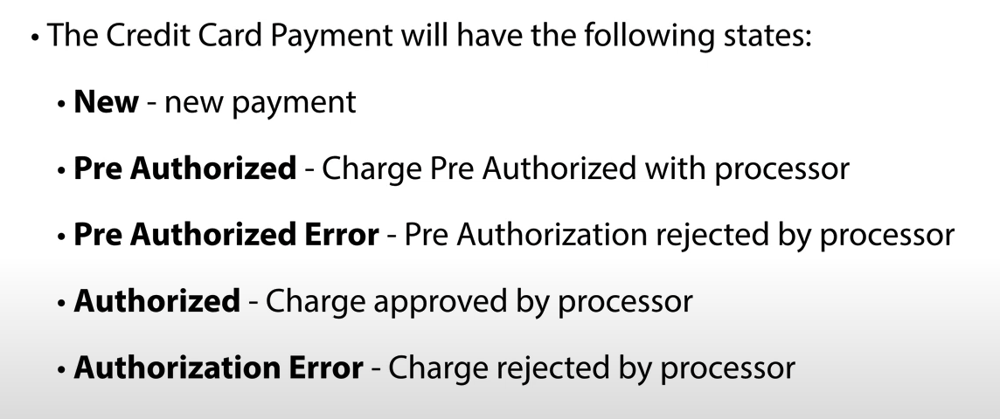
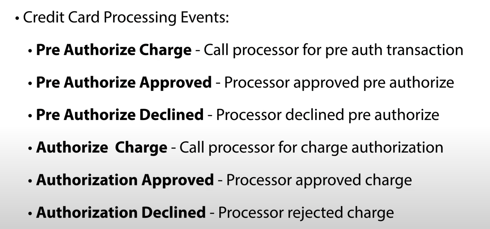

#Payment - Spring State Machine 
Project elaborated with study elaboration

## Reverence
The project was developed following the **`Spring Framework Guru`** channel tutorial : 
* [Getting Started with Spring State Machine](https://www.youtube.com/watch?v=A-dVgRV5-Bw)

_____
### Flow Payment

### States Payment

### Events Payment

-----
### How to test
Run the following tests and view the outputs on the terminal

* Test of **_`PreAuth`_**
    * `PaymentServiceImplTest.testDoPreAuth`
* Test of **_`Auth`_**
  * `PaymentServiceImplTest.testDoAuth`
